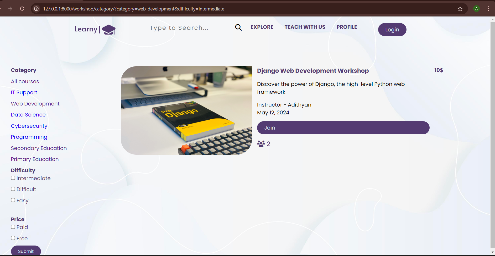
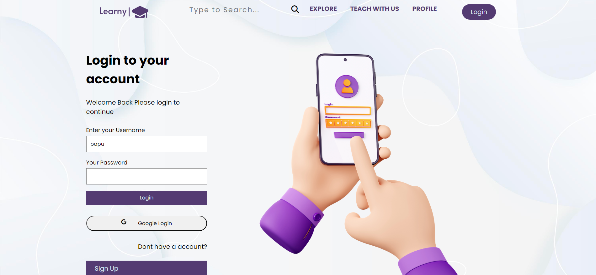
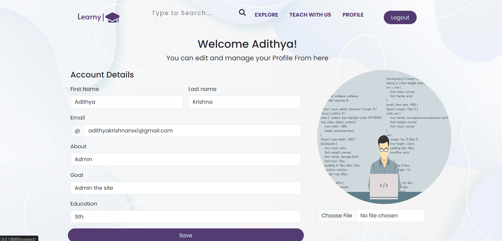

# Learny - Workshop Platform

Learny is a Django project designed to provide users with a seamless workshop experience. 

demonstration video - https://youtu.be/n9dHs2ttKv8?si=gaQT_REQDP7vSCUM

### Explore Section

In the Explore section, users can browse through a catalog-like category section. Here, they can select the topic of the workshop they're interested in. The filter functionality allows users to refine their search based on price, difficulty, and their preferences. Whether it's finding workshops within a certain price range, difficulty level, or based on topics they've liked previously.

### User Authentication and Google Login

Learny features a robust user management system with seamless authentication. Users can register, log in, and manage their accounts effortlessly. Additionally, the integration of Google Login via django-allauth simplifies the authentication process, offering users a quick and secure way to access the platform.

### Profile Section

The Profile section provides users with a personalized space where they can view and manage their workshop engagements. Here, users can access information about the workshops they've joined and edit their profile details.

### Join Workshop

Users have the opportunity to join workshops posted on the site. Joining a workshop is simple and straightforward, allowing users to seamlessly access the workshop link and engage with the content.

### Search
In addition to Explore Users can search for the Workshop they want through Search on the Nav bar

### Teach with Us
This is a simple form which on filling sends me message via gmail.Which help me to give them Instructor Roles
## Getting Started

To get started with Learny, follow these steps:

1. Clone the repository to your local machine.
2. Install the necessary dependencies using `pip install -r requirements.txt`.
3. Set up your Django environment and database configurations.
4. Run the migrations using `python manage.py migrate`.
5. Start the Django development server using `python manage.py runserver`.

## Contributing

We welcome contributions from the community to enhance the functionality and user experience of Learny. If you'd like to contribute, please fork the repository, make your changes, and submit a pull request outlining the proposed improvements.

